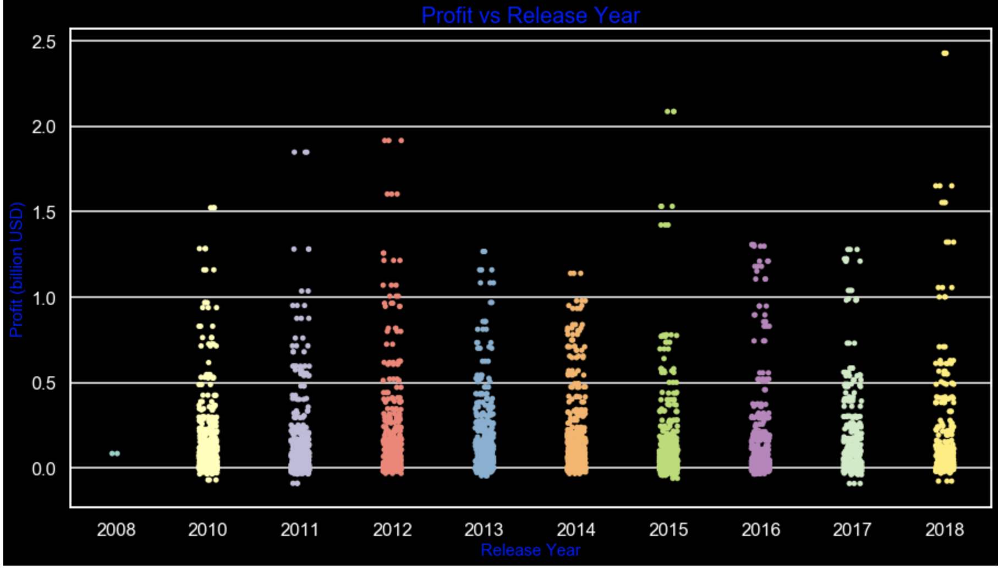

## Profitable Microsoft Studios Analysis By: Khulood Nasher 
In an effort by Microsoft to diversify its investments, they decided to invest in the film industry, and since Microsoft is keen on implementing its plans professionally, they have decided to employ a data scientist  whose job is to explore the data of the movie industry, analyze it and set recommendations based on the outcomes of the analysis.
The data scientist conducted a comprehensive analysis of the movie's data and set a couple of recommendations to what types of movies could be profitable at the box office. The data scientists set the findings based on many factors such as the genre, the season, the production budget, and the length of the movie. The data scientist ended up with  informative visualized recommendations for the executive director of Microsoft.

The following Questions were addressed: 

1- How has the movie industry changed in the last decade from 2008-2018?

2- What production budget range is more profitable for movies?

3- Which season is the most profitable?

4- What are the most successful genres?

5- Which genre is the most profitable for each season?

6- Does the runtime have any effect on the popularity of the genre?

## Data Sources: 
The data was collected from the following github repository:

https://github.com/khuloodnasher/dsc-mod-1-project-v2-1-onl01-dtsc-ft-030220/tree/master/zippedData

## Data Processing

Pandas library was used to read the data as data frames that are stored in the files: 

'tn.movie_budgets.csv.gz' 

‘Imdb.title.basics.csv'
 
 'tmdb.movies.csv.gz'

Tables of movie data were merged and the most correlated features were extracted and processed. 

The targeted features that were analyzed go as follows:

Movie name, genere,release date,runtime, production budget, worldwide gross, and domestic gross. 

Intensive data cleaning was performed such as dropping null values, dropping unnecessary  columns, removing symbols, renaming 

some columns, dropping duplicates, lowering case some columns, formatting date as a datetime object, and creating new 

dataframes.

## Data Analysis

Analyses focused on the movie industry in the last decade 2008-2018.

New Columns were extracted such as release month, and release year from the release date column, runtime in hours, and season using an appropriate function.

### Revenue and Profit  were calculated as follows:

Revenue= Domestic Gross+Worldwide Gross

Profit= Revenue-Production Budget

The Genre column was split to separate genres and the data frame was exploded, so each genre is on its own row. We had 21 

unique genres.

The worldwide gross to the profit was plotted by scatter subplots using a Matplotlib figure.  The profit versus genres was 

also plotted by seaborn stripplot.

The  strong correlation between the production budget and the profit was visualized by the linear regression plot of seaborn l

library.

Monthly profit was visualized by seaborn barplot

A season dataframe was created and grouped by the release season  and release year and aggregated by the mean of the profit 

and was descendent sorted.

The relation between the release season and profit was visualized by barplot.
 
 Profit  by  genres was investigated thoroughly.

new data frame created by grouping by genres and slicing by the  mean of profit in descendant order.

Barh plot of profit versus genres.

Profit to the genres was visualized by  violin plot and stripplot.
    
    Genre trends were analyzed by each season.
 
 A new dataframe was created for each season and was grouped by genres and sliced  by the means of profit and sorted in 
 
 descending order.

profit  was visualized versus genres in each season by barplot.

The popularity of runtime was analyzed for the highest genres that are   action movies,science fiction movies,adventure 

movies,and animation movies.

## Recommendations were suggested  and submitted to microsoft.
 

